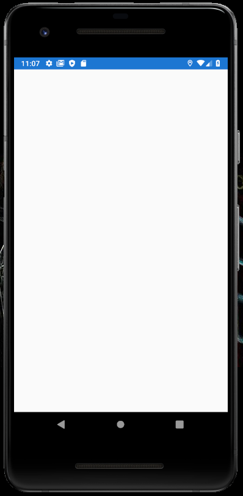
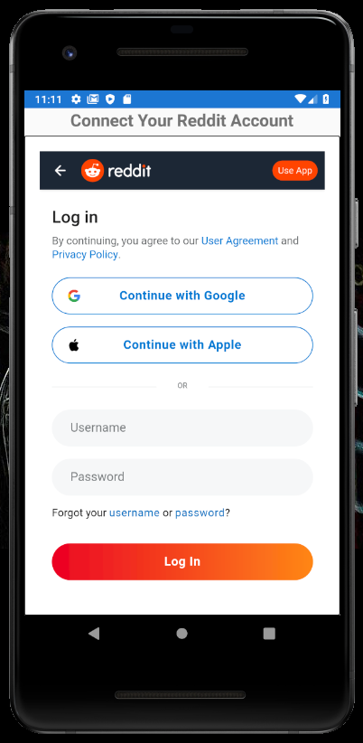
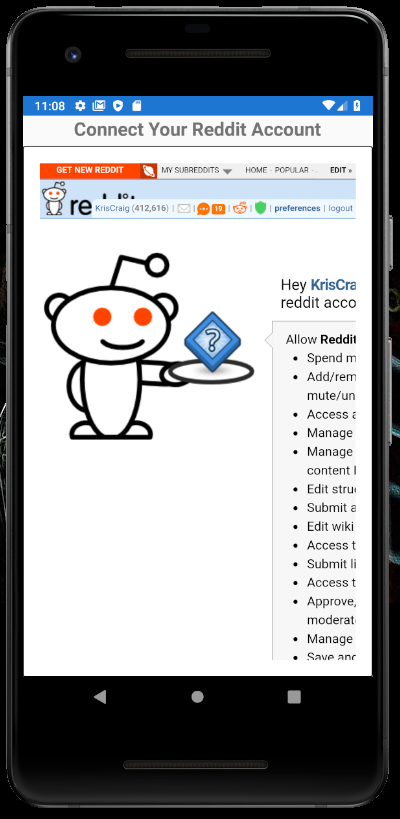
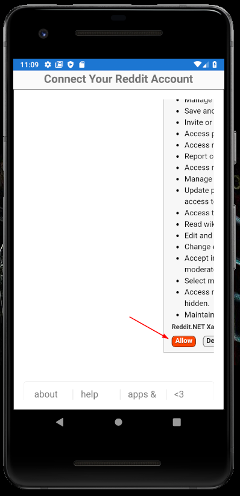
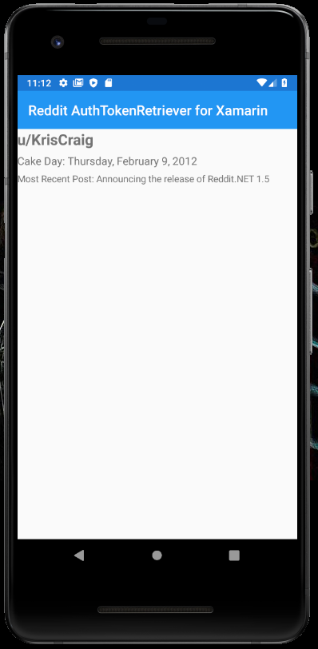
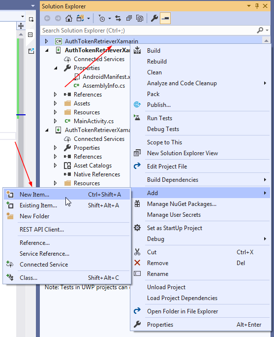
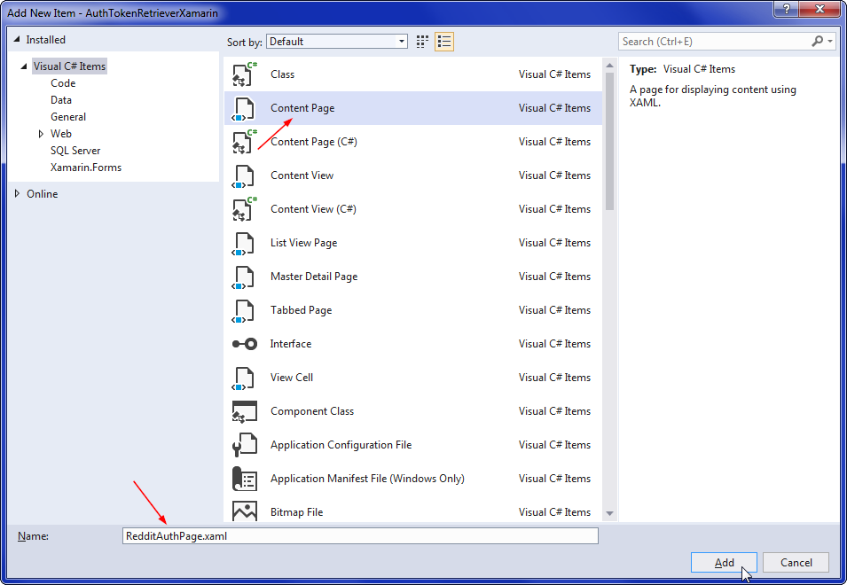

# Tutorial: Use AuthTokenRetrieverLib With Xamarin.Forms

## Author

[Kris Craig](../../../docs/contributors/Kris%20Craig.md)

## Required libraries

[Reddit.NET](https://github.com/sirkris/Reddit.NET)

[Reddit.NET Auth Token Retriever](https://www.nuget.org/packages/Reddit.AuthTokenRetrieverLib)

| Table of Contents                                                                      |
|:---------------------------------------------------------------------------------------|
| [Overview](#overview)                                                                  |
| [Create the Solution](#create-the-solution)                                            |
| [Library Installation](#library-installation)                                          |
| [End-User Workflow](#end-user-workflow)                                                |
| [Load MainPage as a NavigationPage](#load-mainpage-as-a-navigationpage)                |
| [Tell Android to Allow Cleartext Traffic](#tell-android-to-allow-cleartext-traffic)    |
| [Create the Reddit Authorization Page](#create-the-reddit-authorization-page)          |
| [Modify the RedditAuthPage XAML](#modify-the-redditauthpage-xaml)                      |
| [Modify the MainPage XAML](#modify-the-mainpage-xaml)                                  |
| [Modify the MainPage CS](#modify-the-mainpage-cs)                                      |
| [Modify the RedditAuthPage CS](#modify-the-redditauthpage-cs)                          |
| [The Finished Solution](#the-finished-solution)                                        |

## Overview

This tutorial details how to create a simple Xamarin.Forms mobile app that authenticates a Reddit user and retrieves the necessary OAuth tokens.

## Xamarin-Specific Warnings

1. Because Android tends to release BC-breaking changes so frequently, it can be especially challenging to maintain tutorials like this.  As such, if this tutorial instructs you to do something that doesn't line up with what you're seeing in Visual Studio (missing class/directive, code looks different, etc), please file an [Issue](https://github.com/sirkris/Reddit.NET/issues/new/choose) so I can take a look and see if the tutorial needs to be updated.

2. Do yourself a favor and avoid using any dots (".") in your Xamarin.Forms project name.  At least in VS 2019, this leads to all sorts of IO-related build issues.  That's why this project is called AuthTokenRetrieverXamarin instead of AuthTokenRetriever.Xamarin, which would have been my first choice.

3. Some Android phones [reportedly](https://stackoverflow.com/a/14124606/1082604) will only allow an app to bind to an [ephemeral port](https://en.wikipedia.org/wiki/Ephemeral_port).  For this reason, this tutorial will have AuthTokenRetrieverLib listen on port 50080 instead of the default of 8080.

## Create the Solution

Open Visual Studio and create a new Xamarin.Forms project.  Let's call it "AuthTokenRetrieverXamarin".

## Library Installation

In the NuGet Package Manager console, **click on the Default Project dropdown and select AuthTokenRetrieverXamarin**, then type:
    
    Install-Package Reddit
	
	Install-Package Reddit.AuthTokenRetrieverLib

## End-User Workflow

Before we proceed, it would be helpful for you to understand what the finished product is supposed to look like.  So here's a brief rundown of the Reddit authentication process from the end-user's perspective:

### Launch the App

The user begins by launching our app.  Because we haven't bothered to create a splash screen, we'll just see a blank white page for a few moments while the app loads.  This is normal.



### Login to Reddit

The user will be prompted to login.  This will determine which Reddit user we're authenticating.



### Authorize the App

Once logged-in, the user will be redirected to the authorization page.  The user must then click the "Allow" button in order to complete the process.





### View the Success Page

Once the callback is received, the auth page will automatically close and the main page will be populated with the authenticated Reddit user's data.



## Load MainPage as a NavigationPage

This will enable us to navigate to the RedditAuthPage.  First, in AuthTokenRetriever.App, we'll be making two changes to the ctor:

1. Add ```MainPage mainPage``` as a parameter.

2. Instantiate MainPage as a NavigationPage like this:  ```new NavigationPage(mainPage)```

The modified ctor will look like this:

```c#
public App(MainPage mainPage)
{
    InitializeComponent();

    MainPage = new NavigationPage(mainPage);
}
```

That takes care of Xamarin.Forms.  Now we have to update both the Android and iOS projects to match.  In AuthTokenRetrieverXamarin.Droid.MainActivity **and** AuthTokenRetrieverXamarin.iOS.AppDelegate, change the LoadApplication line to this:

```c#
LoadApplication(new App(new MainPage()));
```

## Tell Android to Allow Cleartext Traffic

This is necessary in order to make the WebView compatible with Reddit's callback workflow in Android.  If you don't do this step, the BrowserWindow will fail to load the page in Android.

To fix this, we need to edit Properties/AndroidManifest.xml in the AuthTokenRetrieverXamarin.Android project by adding ```android:usesCleartextTraffic="true"``` to the <application> tag.  So now your Android manifest should look something like this:

```xml
<?xml version="1.0" encoding="utf-8"?>
<manifest xmlns:android="http://schemas.android.com/apk/res/android" android:versionCode="1" android:versionName="1.0" package="com.companyname.authtokenretrieverxamarin">
    <uses-sdk android:minSdkVersion="21" android:targetSdkVersion="28" />
    <application android:label="AuthTokenRetrieverXamarin.Android" android:usesCleartextTraffic="true"></application>
    <uses-permission android:name="android.permission.ACCESS_NETWORK_STATE" />
</manifest>
```

## Create the Reddit Authorization Page

In AuthTokenRetrieverXamarin (the Xamarin.Forms project), add new new ContentPage and call it RedditAuthPage.xaml.  The corresponding RedditAuthPage.xaml.cs will be automatically generated along with it if you're using Visual Studio.





## Modify the RedditAuthPage XAML

We should start by adding a page title to the ContentPage tag:  ```Title="Reddit Authorization"```  While we're at it, we also need to add this:  ```NavigationPage.HasNavigationBar="False"```

The resulting ContentPage tag should look something like this:

```xaml
<ContentPage xmlns="http://xamarin.com/schemas/2014/forms"
             xmlns:x="http://schemas.microsoft.com/winfx/2009/xaml"
             xmlns:d="http://xamarin.com/schemas/2014/forms/design"
             xmlns:mc="http://schemas.openxmlformats.org/markup-compatibility/2006"
             mc:Ignorable="d"
             NavigationPage.HasNavigationBar="False"
             Title="Reddit Authorization"
             x:Class="AuthTokenRetrieverXamarin.RedditAuthPage">
```

The content of the page is pretty basic:  A Label and a WebView.  The label tells the user we're on the auth page and the WebView is what will actually load the Reddit website where the user will have to click Accept.  The following code will work:

```xml
        <AbsoluteLayout Padding="0" HorizontalOptions="FillAndExpand" VerticalOptions="FillAndExpand">
            <StackLayout AbsoluteLayout.LayoutBounds="0, 0, 1, 1" AbsoluteLayout.LayoutFlags="All">
                <Label Text="Connect Your Reddit Account"
                    FontAttributes="Bold"
                    FontSize="Large"
                    HorizontalOptions="Center"
                    VerticalOptions="Start" />
                <Frame BorderColor="Black">
                    <WebView x:Name="BrowserWindow" WidthRequest="1000" HeightRequest="1000" />
                </Frame>
            </StackLayout>
        </AbsoluteLayout>
```

This will display the label at the top with the embedded browser window directly below, filling the remainder of the page.  Placing it in a Frame is only necessary if you want a border around the WebView (I think it looks better that way).

The final RedditAuthPage.xaml file should look something like this:

```xml
<?xml version="1.0" encoding="utf-8" ?>
<ContentPage xmlns="http://xamarin.com/schemas/2014/forms"
             xmlns:x="http://schemas.microsoft.com/winfx/2009/xaml"
             xmlns:d="http://xamarin.com/schemas/2014/forms/design"
             xmlns:mc="http://schemas.openxmlformats.org/markup-compatibility/2006"
             mc:Ignorable="d"
             NavigationPage.HasNavigationBar="False"
             Title="Reddit Authorization"
             x:Class="AuthTokenRetrieverXamarin.RedditAuthPage">
    <ContentPage.Content>
        <AbsoluteLayout Padding="0" HorizontalOptions="FillAndExpand" VerticalOptions="FillAndExpand">
            <StackLayout AbsoluteLayout.LayoutBounds="0, 0, 1, 1" AbsoluteLayout.LayoutFlags="All">
                <Label Text="Connect Your Reddit Account"
                    FontAttributes="Bold"
                    FontSize="Large"
                    HorizontalOptions="Center"
                    VerticalOptions="Start" />
                <Frame BorderColor="Black">
                    <WebView x:Name="BrowserWindow" WidthRequest="1000" HeightRequest="1000" />
                </Frame>
            </StackLayout>
        </AbsoluteLayout>
    </ContentPage.Content>
</ContentPage>
```

We'll come back to add the code for RedditAuthPage.xaml.cs in a bit.  For now, let's shift our attention over to MainPage.

## Modify the MainPage XAML

We need to replace the default crap with a named StackLayout.  We'll call it StackLayout_Main.  Let's also add a page title while we're at it.  The resulting MainPage.xaml should look something like this:

```xml
<?xml version="1.0" encoding="utf-8" ?>
<ContentPage xmlns="http://xamarin.com/schemas/2014/forms"
             xmlns:x="http://schemas.microsoft.com/winfx/2009/xaml"
             xmlns:d="http://xamarin.com/schemas/2014/forms/design"
             xmlns:mc="http://schemas.openxmlformats.org/markup-compatibility/2006"
             mc:Ignorable="d"
             Title="Reddit AuthTokenRetriever for Xamarin"
             x:Class="AuthTokenRetrieverXamarin.MainPage">

    <StackLayout x:Name="StackLayout_Main">
        <!-- Content is generated.  -->
    </StackLayout>

</ContentPage>
```

## Modify the MainPage CS

Now we're ready to deal with MainPage.xaml.cs.

### Dependencies

These will be our ```using``` statements:

```c#
using Reddit;
using Reddit.AuthTokenRetriever;
using Reddit.AuthTokenRetriever.EventArgs;
using System;
using System.ComponentModel;
using Xamarin.Forms;
```

### Properties

For the sake of simplicity, we'll store our configurables here.  If you're creating a production app, it would be ideal to get those values from a config file or some other external data source.

```c#
private const string AppID = "YourAppIdGoesHere";
private const int AuthListenPort = 50080;
private const string AuthListenHost = "127.0.0.1";

private string AccessToken { get; set; }
private string RefreshToken { get; set; }
```

Next, we define our AuthTokenRetrieverLib instance:

```c#
public AuthTokenRetrieverLib AuthTokenRetrieverLib
{
    get
    {
        if (authTokenRetrieverLib == null)
        {
            authTokenRetrieverLib = new AuthTokenRetrieverLib(AppID, AuthListenPort, AuthListenHost);
        }
        return authTokenRetrieverLib;
    }
    set => authTokenRetrieverLib = value;
}
private AuthTokenRetrieverLib authTokenRetrieverLib;
```

Now we do the same for our RedditClient instance:

```c#
private RedditClient Reddit
{
    get
    {
        if (reddit == null && !string.IsNullOrWhiteSpace(RefreshToken))
        {
            reddit = new RedditClient(appId: AppID, refreshToken: RefreshToken, accessToken: AccessToken);
        }
        return reddit;
    }
    set => reddit = value;
}
private RedditClient reddit;
```

While we're at it, let's give ourselves a little shortcut for determining if the RedditClient instance is successfully authenticated:

```c#
public bool RedditAuthenticated
{
    get => (Reddit != null && Reddit.Account != null && Reddit.Account.Me != null && Reddit.Account.Me.Name != null
            && !string.IsNullOrWhiteSpace(RefreshToken));
    private set { }
}
```

The final property is an event handler, which MainPage will fire after consuming the success event from the AuthTokenRetrieverLib.  This event will then be consumed by RedditAuthPage, closing the window and returning the user to MainPage.

```c#
public event EventHandler CloseAuthPage;
```

### Validation

There are multiple places where we'll want to throw an Exception if Reddit fails to authenticate, so it makes sense to put it in its own method:

```c#
private void Validate()
{
    if (!RedditAuthenticated)
    {
        throw new Exception("Reddit authentication failed.");
    }
}
```

### Display Reddit Data

Once authentication is successful, we'll want to display some of the authenticated user's data to show that everything is working.  You can modify this to suit your needs, of course.

```c#
private void PopulateData()
{
    Validate();

    StackLayout_Main.Children.Add(new Label
    {
        Text = "u/" + Reddit.Account.Me.Name,
        FontSize = Device.GetNamedSize(NamedSize.Large, typeof(Label)),
        FontAttributes = FontAttributes.Bold,
        VerticalOptions = LayoutOptions.Start
    });

    StackLayout_Main.Children.Add(new Label
    {
        Text = "Cake Day: " + Reddit.Account.Me.Created.ToString("D"),
        FontSize = Device.GetNamedSize(NamedSize.Subtitle, typeof(Label)),
        VerticalOptions = LayoutOptions.Start
    });

    StackLayout_Main.Children.Add(new Label
    {
        Text = "Most Recent Post: " + Reddit.Account.Me.GetPostHistory(sort: "newForced")[0].Title,
        FontSize = Device.GetNamedSize(NamedSize.Small, typeof(Label)),
        VerticalOptions = LayoutOptions.Center
    });
}
```

### Receive Event Callback

As of 1.5, AuthTokenRetrieverLib fires an event upon successful authentication.  This event contains the token data we'll need to load our RedditClient instance.

```c#
public void C_AuthSuccess(object sender, AuthSuccessEventArgs e)
{
    RefreshToken = e.RefreshToken;
    AccessToken = e.AccessToken;

    Validate();

    AuthTokenRetrieverLib.AuthSuccess -= C_AuthSuccess;
    AuthTokenRetrieverLib.StopListening();

    CloseAuthPage?.Invoke(this, null);
    Device.BeginInvokeOnMainThread(() => PopulateData());
}
```

We start by setting our credentials received from the event.  The way our getters are setup, the call to ```Validate``` will automatically reinitialize our RedditClient instance with the new token data if everything's good (and throw an Exception if it's not).  Then we clean up after ourselves by unregistering the callback and telling AuthTokenRetrieverLib to terminate the server.

With all that out of the way, we're free to fire the event that will tell RedditAuthPage to close.  Now that the user is back on MainPage, we make a call to ```PopulateData``` and we're good to go.  Note that using ```Device.BeginInvokeOnMainThread``` is a good idea whenever you're doing anything from an event callback that modifies the view in Xamarin.

### The Constructor

We need to add a couple lines to the ctor:

```c#
AuthTokenRetrieverLib.AuthSuccess += C_AuthSuccess;
Navigation.PushAsync(new RedditAuthPage(this));
```

The first registers the auth success event, the second opens the RedditAuthPage.

## Modify the RedditAuthPage CS

All that's left is to fill in the C# code for our RedditAuthPage.

### Dependencies

We just need the basic Xamarin usings here:

```c#
using Xamarin.Forms;
using Xamarin.Forms.Xaml;
```

### Properties

We'll need to be able to access our MainPage instance from here, so we'll add this property:

```c#
private MainPage MainPage { get; set; }
```

### Disble the Back Button

We don't want the user accidentally closing the RedditAuthPage before we've completed the workflow, so we add this method:

```c#
protected override bool OnBackButtonPressed()
{
    return true;
}
```

### Handle Browser Redirect

This next step is necessary because, for some reason, Reddit doesn't redirect the user back to the authorization URL after they've logged in.  Instead, it redirects them to the Reddit front page, which means we need to then redirect the user *back* to the authorization URL so they can click "Accept" and complete the process.

```c#
public void C_NavigatedUpdated(object sender, WebNavigatedEventArgs e)
{
    if (e.Url.TrimEnd('/').EndsWith("reddit.com"))
    {
        BrowserWindow.Source = MainPage.AuthTokenRetrieverLib.AuthURL();
    }
}
```

This will fire whenever the page in our BrowserWindow changes.  It won't do anything unless that new page is the Reddit front page, in which case it'll redirect the user back to where they need to be.

### Consume Close Event

Here's where we put our callback function that closes this page and returns the user to MainPage when the authentication process has completed:

```c#
public void C_AuthClose(object sender, object e)
{
    MainPage.CloseAuthPage -= C_AuthClose;
    Device.BeginInvokeOnMainThread(async () => await Navigation.PopAsync());
}
```

### Modify the Constructor

We need to do a couple things here before we're done.  First, the ctor needs to accept an instance of MainPage as an argument:

```c#
public RedditAuthPage(MainPage mainPage)
```

Then we add some code:

```c#
MainPage = mainPage;
MainPage.AuthTokenRetrieverLib.AwaitCallback();
MainPage.CloseAuthPage += C_AuthClose;
```

Here we're setting our MainPage property, activating the webserver used by AuthTokenRetrieverLib to receive the token data from the browser, and registering our AuthClose event.

Now just a couple more lines of code and we're done:

```c#
BrowserWindow.Source = MainPage.AuthTokenRetrieverLib.AuthURL();
BrowserWindow.Navigated += C_NavigatedUpdated;
```

This navigates the embedded browser window to the Reddit authorization URL and registers the event handler we're using to handle the redirect.

The final constructor should look like this:

```c#
public RedditAuthPage(MainPage mainPage)
{
    InitializeComponent();

    MainPage = mainPage;
    MainPage.AuthTokenRetrieverLib.AwaitCallback();
    MainPage.CloseAuthPage += C_AuthClose;

    BrowserWindow.Source = MainPage.AuthTokenRetrieverLib.AuthURL();
    BrowserWindow.Navigated += C_NavigatedUpdated;
}
```

That's it!  We're done.

## The Finished Solution

The complete source code can be found here:  **https://github.com/Reddit-NET/AuthTokenRetrieverXamarin**
